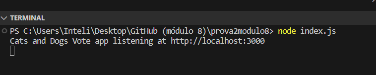
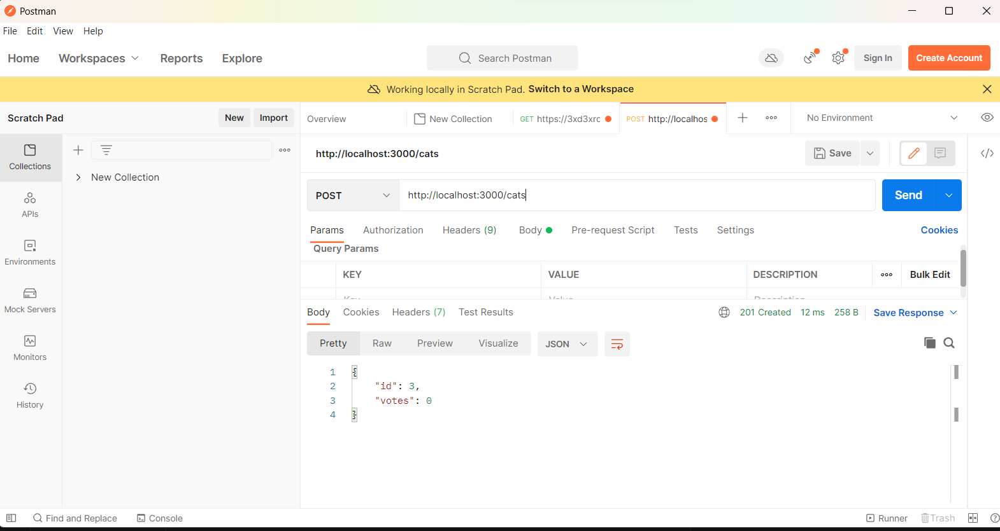

# 20232BSET03P2
Inteli - Engenharia de Software | Avaliação 2023-2B P2

#### Aluna: Livia L Coutinho

## Letra b) --> Sanitizar e validar dados de entrada para evitar SQL Injection.

- Mudanças no esquema das tabelas:

Adição de "INTEGER PRIMARY KEY" nas colunas "id" das tabelas "cats" e "dogs" - chave primária única para cada linha na tabela e permite a identificação exclusiva de cada registro.

- Prepared Statements:

As queries SQL foram alteradas para uso de prepared statements -  os valores dos parâmetros são passados separadamente das instruções SQL, evitando a interpolação direta de strings e ajudando a prevenir SQL Injection.

- Sanitizar dados de entrada:

Uso de placeholders (?) nos comandos SQL e passar os valores fornecidos separadamente. 

- Finalizar as declarações:

Após a execução das queries preparadas, há a inclusão de stmt.finalize();. Isso garante que as declarações preparadas sejam encerradas após a execução, liberando recursos.

- GET:

Adição de rotas GET para cats and dogs para buscar dados das tabelas correspondentes. 

## Letra c) --> Corrigir a lógica de votação para que verifique se o registro do animal existe antes de adicionar um voto.

- animalExists

Adição da função animalExists que recebe o nome da tabela (animalType), o ID do animal e um callback para retornar se o animal existe ou não no banco de dados.

- (/vote/:animalType/:id)

Nas rotas de votação , foi chamada a função animalExists para verificar se o animal existe antes de incrementar os votos.

- Verificação

Verificações para retornar mensagens apropriadas se o animal não for encontrado ou se ocorrerem erros ao verificar a existência ou ao atualizar os votos.

## Letra d) --> Implementar e tratar erros de maneira adequada, sem vazar detalhes de implementação.

- Tratamento de erro na função animalExists, enviando uma mensagem apropriada para o erro.
- A função animalExists agora chama o callback sem enviar o erro em caso de sucesso.
- Adição de finalização do statement stmt após o seu uso para prevenir vazamento de recursos.
- Correção do nome da variável err para error na função de callback.
- Envio do erro recebido na verificação de existência do animal na rota de votação.
- Finalização do statement stmt após o seu uso na rota de votação para evitar vazamento de recursos (letra a)

## letra e) --> Implementar todos os métodos que possuem assinatura no código.

Alterações feitas:

Tratamento de erros:
- --> verificar a existência do animal.
- --> ajuste na passagem de erros nas funções callback.

Finalização adequada:
- --> comandos para finalizar operações no banco de dados após o uso.

Correção de erros na rota de votação:
- --> tratamento apropriado de erros na rota de votação.

   

   
